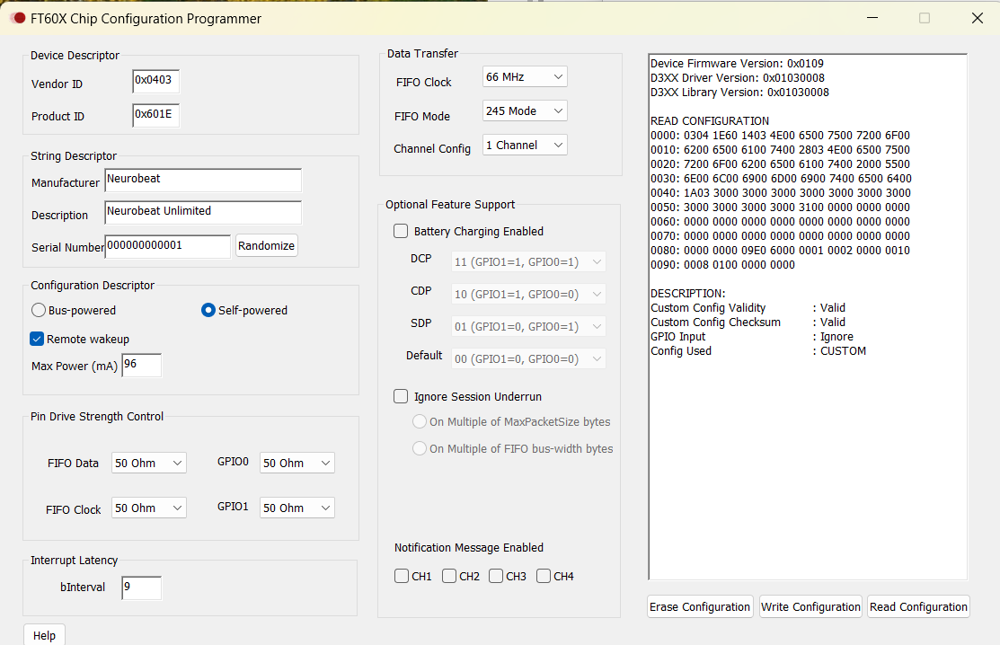

# ftdi-ft600-to-lattice-ice40hx-fpga
This design runs the streaming example of FTDI FT600 (16-bit bus), using a Lattice iCE40-HX FPGA. It uses the iCE40HX8K Breakout Board and a UMFT600X-B, connected through a custom adapter that connects the 40-pin connector `J2` of iCE40HX8K Breakout Board with the ANSI/VITA 57.1-2008 FMC LPC Connector of UMFT600X-B using a [Samtec ASP-134603-01](https://www.mouser.com/ProductDetail/200-ASP-134603-01).

## Notes on Configuration of Boards

iCE40HX8K Breakout Board has all I/O banks configured to 3.3V. As such, UMFT600X-B must be configured to 3.3V by removing the jumper from JP2 and putting it on JP6. FT600 has been configured to 66MHz, 245 Mode and 1 Channel with the `FT60X Chip Configuration Programmer`. As such, the two GPIOs aren't used for configuring mode and can be used to perform the Abort Recovery sequence if necessary. Notification Messages aren't enabled for FT600.



The iCE40HX8K Breakout Board has a quick programming mode that configures the FPGA only and one that flashes the configuration so that it can be used as default configuration at power up. You can pick whichever mode you want by changing the direction of the jumpers.

## Notes on AN_376 and SP601 Spartan-6 FPGA SP601 Evaluation Kit
This kit seems to take care of a few details one can't figure out from the FTDI Application note `AN_376 Xilinx FPGA FIFO master Programming Guide`. Those are: What pins are `R/W_OOB`? What's the deal with the two resets `S/HRST_N`?

You can find this code in `mst_bus.ucf` in `spartan6_mst_fifo16_1.1_20170919/ucf` of the "FPGA Firmware/Bitstream" section Spartan 16 zip (`spartan6_mst_fifo16_1.1.zip`) for FT600.

```
NET "R_OOB"            LOC = "B2"  |IOSTANDARD=LVCMOS25 |SLEW=FAST;
NET "W_OOB"            LOC = "A2"  |IOSTANDARD=LVCMOS25 |SLEW=FAST;

NET "SRST_N"          LOC = "C8";  
NET "HRST_N"          LOC = "P4";  
```

From the schematic of SP601:
* `B2` is `IO_L02P_0_B2` and net `FMC_LA14_P` that leads to pin `C18` of `J1` - ANSI/VITA 57.1-2008 FMC LPC Connector. Then you can follow pin `C18` on the `FIFO TO USB 3.0 Bridge Evaluation Board - UMFT60xx` document where it leads to `GPIO_0` net and pin 17 of FT600.
* `A2` is `IO_L02N_0_A2` and net `FMC_LA14_N` that leads to pin `C19` of `J1` - ANSI/VITA 57.1-2008 FMC LPC Connector. Then you can follow pin `C19` on the `FIFO TO USB 3.0 Bridge Evaluation Board - UMFT60xx` document where it leads to `GPIO_1` net and pin 18 of FT600. 

Reset Lines:

* `C8` is `IO_L11N_0_C8` and net `FMC_LA10_N` that goes to the header `J1` - ANSI/VITA 57.1-2008 FMC LPC Connector on the pin `C15`, `LA10_N`. Then you can follow pin `C15` on the `FIFO TO USB 3.0 Bridge Evaluation Board - UMFT60xx` document where it leads to another push-button that resets both the FT600Q and the FPGA apparently.
* `P4` is `IO_L02P_3_P4` and net `GPIO_BUTTON0` that goes to a push button (SW6) that does "hard reset". It has a pull-down and when you push it, it goes to 1. It's reversed in HDL on `fifo_top`: `.HRST_N (!HRST_N)`. Either of those two signals can be `1` to set reset ("and" on the IO module).

The expressions `(!W_OOB) & RST_N` and `(!R_OOB) & RST_N` mean that those modules reset also when there's an Abort Recovery sequence indicated out-of-band with the two GPIO pins.

Bottom line - we don't connect any reset buttons on this design. The reset is driven by the iCE40 PLL lock technique one can find in [npetersen2/iCE40_Template: Template HDL files for getting started with the Lattice iCE40 FPGAs](https://github.com/npetersen2/iCE40_Template/tree/master).
